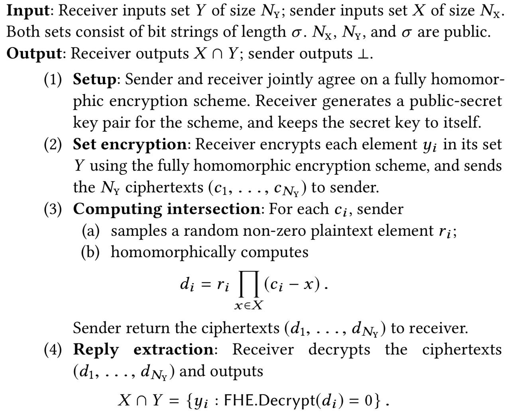

# PSI demo

Basic implementation of [Fast Private Set Intersection from Homomorphic Encryption](https://dl.acm.org/doi/10.1145/3133956.3134061) by Chang et al., 2017 using [Microsoft SEAL](https://github.com/microsoft/SEAL) through [node-seal](https://github.com/morfix-io/node-seal/).

## The algorithm

For the complete algorithm, please refer to [Chang et al.](https://dl.acm.org/doi/10.1145/3133956.3134061). This is a summary of its simplest version:

Note that, as usual in PSI algorithms, for both parties to know the intersection the algorithm must be run twice, once in each direction.

## Optimization

To limit the circuit depth to n, instead of directly comparing the sets X and Y we split the set X into |X|/n subsets of size n each and perform the PSI between Y and each of these subsets. This significantly improves the performance of the algorithm.

## Implementation

We implement the algorithm using [node-seal](https://github.com/morfix-io/node-seal/), a wrapper library of [Microsoft SEAL](https://github.com/microsoft/SEAL), the most widely used FHE library both in the academia and in the industry.

The PSI algorithm is implemented in the [logic.tsx](client/src/logic.tsx) file. It is executed by two clients, which communicate with each other through a server whose only task is to relay messages between them. The server is only implemented for the purpose of having a visual demonstration in the browser, and would not be necessary at all if the clients were communicating, for example, via TCP/IP. All the computation is done on the clients -- we invite you to check the [server code](relaying-server/index.ts) and verify for yourself that no computation is executed there.

## Running the demo

To run the demo, first open the terminal in the [relaying-server](relaying-server/) folder, run `npm install`, and then run `npx nodemon index.ts`. Leave this terminal open, and open a new terminal in the [client](client/) folder. In the new terminal, run `npm install` and then run `npm start`. Open two windows of the browser in localhost:3000, and start playing with the PSI!

**Important: To avoid running into errors, make sure that exactly two client windows are open. If more windows are open, the results may be incorrect, as this implementation is intended for peer to peer PSI.**

## Future work

We will soon add benchmarking code and results.

The efficiency of the algorithm can be further improved by running step 3 in parallel for each subset of the set X. We plan to implement and test it shortly.

## Contact information

If you have any questions, please do not hesitate to [shoot me an email](mailto:acuna@stanford.edu).
